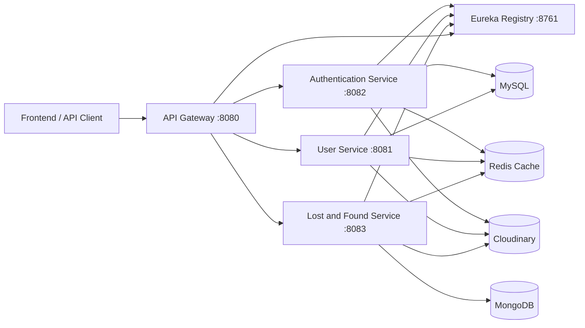

# ReunionSphere Full Stack App

ReunionSphere is a Spring Boot microservices backend for a lost-and-found and user-management platform. The system is split into a small set of focused services that communicate through a central API Gateway and register with a Eureka Service Registry.

This repository contains the backend services only. Each service owns its own configuration, persistence layer, and API surface, which keeps the application modular and easier to scale.

## Architecture Overview

The backend is organized around these building blocks:

- **Service Registry**: Eureka server used for service discovery.
- **API Gateway**: Single entry point for external clients.
- **Authentication Service**: Handles registration, login, JWT, and Google OAuth.
- **User Service**: Manages user profiles, locations, subscriptions, and profile images.
- **Lost and Found Service**: Manages lost/found reports, media uploads, and search/filter flows.
- **Config Server**: Present as a dedicated service module for centralized configuration, although the current codebase only shows its bootstrap application properties.

## Services

### 1. API Gateway

**Module:** `api-gateway`

**Purpose:**

- Serves as the public entry point for all clients.
- Routes requests to the correct microservice via Eureka service discovery.
- Exposes gateway and actuator endpoints for monitoring and debugging.

**Port:** `8080`

**Key configuration:**

- Uses Eureka at `http://localhost:8761/eureka`
- Discovery locator is enabled
- Routes are defined for user, auth, and lost-and-found APIs

**Gateway routes:**

- `/api/v1/users/**` -> `lb://user-service`
- `/api/v1/subscriptions/**` -> `lb://user-service`
- `/api/v1/locations/**` -> `lb://user-service`
- `/api/v1/auth/**` -> `lb://auth-service`
- `/api/v1/reports/**` -> `lb://lost-and-found-service`

**Notes:**

- The gateway uses Spring Cloud Gateway WebFlux.
- Routes are service-name based, so the target service must be registered in Eureka with the same application name used in the gateway URI.
- Request paths must match the controller mappings in the downstream service exactly.

### 2. Service Registry

**Module:** `Service-Registry`

**Purpose:**

- Hosts Eureka Server.
- Keeps track of all running microservices.
- Allows the gateway and services to find each other by service name.

**Port:** `8761`

**Key configuration:**

- `eureka.client.register-with-eureka=false`
- `eureka.client.fetch-registry=false`

### 3. Authentication Service

**Module:** `authentication-service`

**Purpose:**

- Handles user registration and authentication.
- Issues JWT tokens.
- Supports Google login.
- Manages security configuration, custom user details, refresh tokens, and auth-related exceptions.

**Port:** `8082`

**Data store:**

- MySQL database: `reunionSphere_auth_service_DB`

**Cache / integrations:**

- Redis cache
- Google OAuth2
- JWT-based authentication
- Eureka registration enabled

**Main API prefix:**

- `/api/v1/auth`

**Endpoints:**

- `POST /api/v1/auth/register`
- `POST /api/v1/auth/login`
- `POST /api/v1/auth/google`

**Important classes:**

- `Controller/AuthController.java`
- `Services/AuthenticationService.java`
- `Config/SecurityConfig.java`
- `Config/JwtTokenProvider.java`
- `Config/JwtAuthenticationFilter.java`
- `Repository/AuthUsersRepo.java`

### 4. User Service

**Module:** `User-Service`

**Purpose:**

- Manages user profiles.
- Stores and updates user location records.
- Handles subscriptions.
- Uploads profile images.
- Integrates with Cloudinary for media storage.

**Port:** `8081`

**Data store:**

- MySQL database: `reunionSphere_user_service_DB`

**Cache / integrations:**

- Redis cache
- Cloudinary image storage
- Eureka registration enabled

**Main API prefixes:**

- `/api/v1/users`
- `/api/v1/locations`
- `api/v1/subscriptions`  
  Note: this controller currently omits the leading slash in its class-level mapping, so the effective route depends on Spring's request mapping resolution and should be corrected for consistency.

**Endpoints:**

**Users**

- `GET /api/v1/users/`
- `GET /api/v1/users/id/{userId}`
- `GET /api/v1/users/email/{email}`
- `PUT /api/v1/users/{userId}`
- `POST /api/v1/users/`
- `DELETE /api/v1/users/{userId}`
- `POST /api/v1/users/profile-image`

**Locations**

- `GET /api/v1/locations/{locationId}`
- `PUT /api/v1/locations/{locationId}`
- `POST /api/v1/locations/`
- `DELETE /api/v1/locations/{locationId}`

**Subscriptions**

- `GET /api/v1/subscriptions/{subscriptionId}`
- `GET /api/v1/subscriptions/email/{emailId}`
- `GET /api/v1/subscriptions/phoneNumber/{phoneNumber}`
- `GET /api/v1/subscriptions/`
- `PUT /api/v1/subscriptions/{id}`
- `POST /api/v1/subscriptions/`
- `DELETE /api/v1/subscriptions/id/{subscriptionId}`
- `DELETE /api/v1/subscriptions/email/{emailId}`

**Important classes:**

- `Controllers/UserController.java`
- `Controllers/LocationController.java`
- `Controllers/SubscriptionController.java`
- `Services/UserService.java`
- `Services/LocationService.java`
- `Services/SubscriptionService.java`
- `Config/CloudinaryConfig.java`

### 5. Lost and Found Service

**Module:** `LostAndFoundService`

**Purpose:**

- Manages lost and found reports.
- Handles multipart uploads for report images.
- Supports create, update, fetch, and delete flows for report records.
- Uses MongoDB for report storage.

**Port:** `8083`

**Data store:**

- MongoDB database: `Report_Db`

**Cache / integrations:**

- Redis cache
- Cloudinary image storage
- Swagger/OpenAPI UI path configured
- Eureka registration enabled

**Main API prefix:**

- `/api/v1/reports`

**Endpoints:**

- `GET /api/v1/reports`
- `GET /api/v1/reports/{id}`
- `POST /api/v1/reports` with multipart form data
- `PUT /api/v1/reports` with multipart form data
- `DELETE /api/v1/reports/{id}`
- `DELETE /api/v1/reports` with a list of report IDs in the request body

**Important classes:**

- `Controllers/LostAndFoundController.java`
- `Services/ReportService.java`
- `Services/CloudinaryService.java`
- `Repository/ReportRepo.java`
- `Utils/EntityMappers.java`

### 6. Config Server

**Module:** `Config-Server`

**Purpose:**

- Exists as a dedicated Spring Boot module for centralized configuration.
- The current repository snapshot only shows the bootstrap application properties, so the implementation appears to be incomplete or not yet committed.

**Observed configuration:**

- `spring.application.name=Config-Server`

## External Dependencies

The services rely on the following infrastructure components:

- **MySQL** for the authentication and user services.
- **MongoDB** for the lost-and-found service.
- **Redis** for caching.
- **Cloudinary** for image storage.
- **Google OAuth2** for Google-based login in the authentication service.
- **Eureka** for service registration and discovery.

## Startup Order

For local development, start the services in this order:

1. **Service Registry** on port `8761`
2. **Config Server** if you are using centralized configuration
3. **Authentication Service** on port `8082`
4. **User Service** on port `8081`
5. **Lost and Found Service** on port `8083`
6. **API Gateway** on port `8080`

Starting the registry first is important because the gateway and the downstream services depend on Eureka to resolve service names.

## Environment Variables

The services use environment-variable-based configuration for portability. Common variables include:

- `HOST_NAME`
- `PORT`
- `SERVER_PORT`
- `SQL_USERNAME`
- `SQL_PASSWORD`
- `DB_URL`
- `GOOGLE_CLIENT_ID`
- `GOOGLE_CLIENT_SECRET`
- `JWT_SECRET`
- `JWT_ACCESS_EXPIRATION`
- `JWT_REFRESH_EXPIRATION`
- `CACHE_TYPE`
- `CACHE_HOST`
- `REDIS_PORT`
- `CLOUDINARY_CLOUD_NAME`
- `CLOUDINARY_API_KEY`
- `CLOUDINARY_API_SECRET`
- `FRONTEND_URL`
- `MONGODB_URI`
- `MONGODB_DATABASE`

## Useful Request Flow

A typical request path looks like this:

1. A client calls the API Gateway on port `8080`.
2. The gateway matches the request path and resolves the target service through Eureka.
3. The request is forwarded to the appropriate microservice.
4. The microservice handles business logic and persistence.
5. The response returns through the gateway to the client.

## Common Entry Points

- Authentication: `http://localhost:8080/api/v1/auth/...`
- Users: `http://localhost:8080/api/v1/users/...`
- Locations: `http://localhost:8080/api/v1/locations/...`
- Subscriptions: `http://localhost:8080/api/v1/subscriptions/...`
- Reports: `http://localhost:8080/api/v1/reports/...`

## Implementation Notes

- The lost-and-found service package name uses `ReuinonSphere` in several places. That spelling is consistent inside the module, but it is misspelled compared with the rest of the repository naming. If you later standardize package names, do it carefully and across the whole module.
- The user service controllers expose multiple resource types from one module, which is acceptable for this project but should be kept clearly documented because it affects gateway routing.
- Gateway route definitions should remain aligned with controller prefixes. If a controller path changes, the gateway config must be updated at the same time.

## Quick Validation

If the services are running, the quickest checks are:

- Open Eureka at `http://localhost:8761`
- Call the gateway at `http://localhost:8080`
- Verify auth routes under `/api/v1/auth`
- Verify user routes under `/api/v1/users`, `/api/v1/locations`, and `/api/v1/subscriptions`
- Verify report routes under `/api/v1/reports`

## Project Layout

- `api-gateway/` - Gateway entry point and route configuration
- `authentication-service/` - Auth and security service
- `User-Service/` - User, location, and subscription service
- `LostAndFoundService/` - Lost/found report service
- `Service-Registry/` - Eureka service registry
- `Config-Server/` - Centralized configuration service scaffold

## Summary

This project is a Spring Boot microservice backend built around service discovery, centralized routing, and separated domain ownership. The gateway is the single external entry point, the registry coordinates service lookup, and each business service owns its own persistence and API surface.
