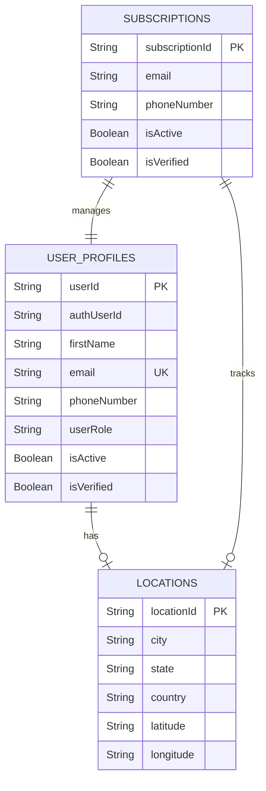
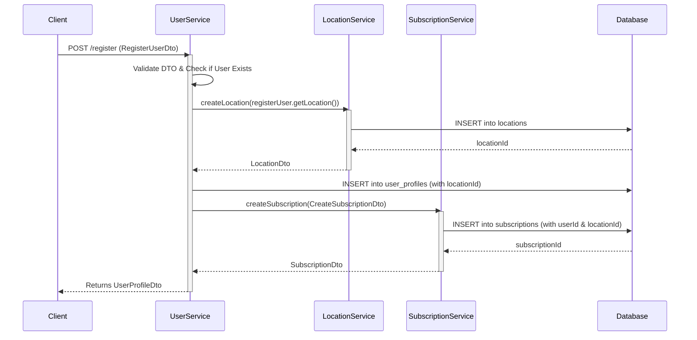

# ReunionSphere - User Service

## Overview
The **User Service** is a core microservice in the ReunionSphere application ecosystem. It is responsible for managing user identities, their physical or preferred locations, and their active subscriptions. Built with Spring Boot, this service ensures strict data integrity, handles complex transactional boundaries, and leverages caching to provide lightning-fast data retrieval.

## Key Features
- **User Profile Management**: Full CRUD capabilities for user identities, roles, and profiles.
- **Location Tracking**: Manages and stores geographical and address details for users.
- **Subscription Management**: Handles user subscriptions, verification statuses, and role-based access.
- **Transactional Consistency**: Guarantees ACID properties by tying User, Location, and Subscription creation into single atomic transactions.
- **High Performance**: Integrated with Spring Cache (`@Cacheable`, `@CachePut`, `@CacheEvict`) to minimize redundant database hits.
- **Robust Error Handling**: Centralized global exception management returning standard RESTful JSON error payloads.

## Tech Stack
- **Framework**: Spring Boot 3.x
- **Language**: Java 17+
- **Persistence**: Spring Data JPA / Hibernate
- **Caching**: Spring Cache Abstraction
- **Utilities**: Lombok, SLF4J (Logging), MapStruct (Entity mapping)

---

## Architecture & Workflow

The User Service follows a standard Controller-Service-Repository architecture. 

### Data Flow Overview

1. **Client Request**: The client sends a REST API request to a Controller.
2. **Service Layer**: The Controller delegates the business logic to the corresponding Service (`UserService`, `LocationService`, or `SubscriptionService`).
3. **Caching**: The Service layer intercepts the call to check if the requested data exists in the cache. 
4. **Data Access**: If not cached (or if an update/creation is happening), the Service interacts with the Repository layer (Spring Data JPA) to access the underlying database.
5. **Entity Mapping**: DTOs (Data Transfer Objects) are mapped to database Entities (and vice versa) using `EntityMapper`.
6. **Response**: A standardized response or error (via `GlobalExceptionHandler`) is returned to the client.

### Entity Relationship Diagram (ERD)



*Note: `Subscriptions` is the owning side of the bidirectional relationship with `UserProfiles` to eliminate foreign key redundancy.*

---

## Core Operations

### 1. User Registration Flow
When a new user registers, the system must create their Location, User Profile, and Subscription cohesively. This is wrapped in a `@Transactional` boundary to prevent partial data writes if any step fails.



### 2. Caching Strategy
To optimize performance, standard entity queries are cached.
- **Read (`@Cacheable`)**: Data is fetched from the cache if present; otherwise, it hits the DB and populates the cache.
- **Update (`@CachePut`)**: Ensures that any modifications to a user, location, or subscription automatically update the cache in real-time.
- **Delete (`@CacheEvict`)**: Removes the specified entity from the cache to prevent stale data.

## Getting Started

### Prerequisites
- JDK 17 or higher
- Maven 3.6+
- Underlying Database (MySQL/PostgreSQL) running locally or via Docker

### Build & Run
1. Navigate to the project root: `cd User-Service`
2. Clean and compile the project:
   ```bash
   ./mvnw clean compile
   ```
3. Run the Spring Boot application:
   ```bash
   ./mvnw spring-boot:run
   ```

## Development Standards
- **Exceptions**: Never throw generic `RuntimeException`. Always use specific domain exceptions (e.g., `UserNotFoundException`) or `IllegalArgumentException`.
- **Logging**: Use `@Slf4j` with proper log levels (`INFO` for transactions, `DEBUG` for data traces, `ERROR` for exceptions).
- **Transactions**: Multi-table writes must be enclosed within `@Transactional`.
